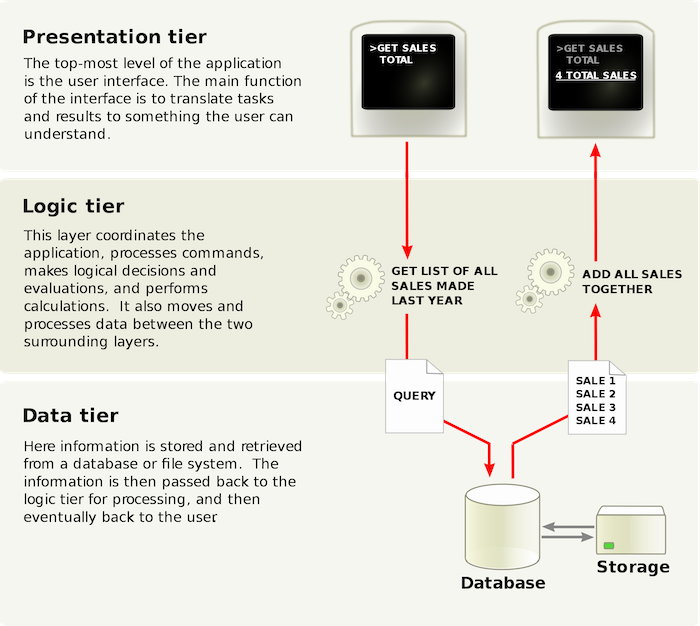
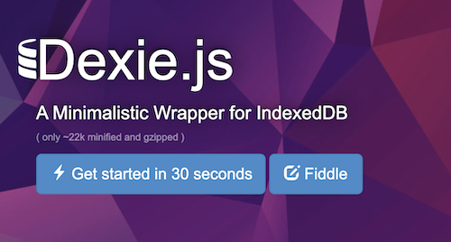
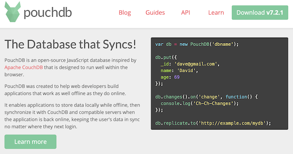

<!-- .slide: class="titulo" -->

## Tema 2: Desarrollo en el cliente con Javascript estándar 
## Parte 2: Modelo del dominio. Comunicación con el servidor. Persistencia

---

# Indice 

1. Introducción. Modelo del dominio
2. Persistencia remota en el servidor
3. Persistencia local

---

<!-- .slide: class="titulo" -->

# 1. 
# Introducción. Modelo del dominio

---





---


En esta parte estamos en las capas "por debajo" del DOM y los *controllers*. Es el código que se ocupa de:

- Capa de negocio o servicios: (modelo de objetos, lógica de negocio, validación de datos)
- Capa de persistencia (remota: enviar/recibir datos a/desde el servidor, persistencia local)

---


## El modelo del dominio

El "núcleo" de la aplicación, independiente de la interfaz. En aplicaciones clásicas reside en el *backend*. En aplicaciones modernas, en *backend* y *frontend*

Son simplemente clases JS y en aplicaciones pequeñas se puede obviar, podemos crear los objetos "sobre la marcha" sin que pertenezcan a ninguna clase.

Ejemplo: [diagrama de clases de Leaflet.JS](https://leafletjs.com/examples/extending/extending-1-classes.html)


---

<!-- .slide: class="titulo" -->

# 2.
# Persistencia remota en el servidor

---

Necesitamos sincronizar los modelos guardados en el navegador con el servidor, esto lo haremos llamando a un API REST. Por ejemplo, en una *app* de una biblioteca:

- Cuando el usuario rellena un formulario en el navegador para dar de alta un  nuevo `Libro` tendremos que lanzar una petición POST para crearlo también en el servidor
- Para obtener un listado de libros, hay que hacer una petición GET y transformar el JSON a un array de objetos JS


---

## AJAX

*Asynchronous Javascript And XML*

Es una combinación de tecnologías:

- **API `fetch`** para **hacer peticiones HTTP al servidor** con Javascript y recibir la respuesta sin cambiar de página
- ***XML***: al comienzo era el formato de intercambio de datos cliente/servidor. Hoy en día JSON.
- **API DOM**: actualizar **solo parte de la página** con los datos del servivor

---

## Formato de datos en AJAX

Originalmente se usaba XML para intercambiar datos, pero es tedioso de *parsear* con JS (hay que usar el API DOM), mientras que convertir una cadena de texto JSON a objeto JS es trivial con el API estándar

```javascript
//Si esto fuera AJAX de verdad, este texto vendría en la respuesta del servidor
var texto = '{"login":"pepe", "nombre": "Pepe Pérez"}'
//De cadena JSON a objeto JS
var objeto = JSON.parse(texto)
console.log(objeto.login) //pepe
//De objeto JS a cadena JSON
console.log(JSON.stringify(objeto))
```

---

## `fetch` API

El API recomendado actualmente para hacer peticiones AJAX. Prácticamente todos los navegadores actuales [lo implementan](http://caniuse.com/#search=fetch). 

```javascript
fetch('https://api.github.com/users/octocat')
  .then(function(respuesta){
     if (respuesta.ok) {
       alert('El servidor devuelve OK: ' + respuesta.status)
     }
  })
  .catch(function(error){
      console.log('FAIL!!')
      console.log(error)
  })
//Cuidado, fetch es asíncrono  
console.log('Cuando se ejecuta esto todavía no se ha recibido la respuesta!!')
```
Buenas intros al API: 

- [https://davidwalsh.name/fetch](https://davidwalsh.name/fetch) (básica)
- [https://developers.google.com/web/updates/2015/03/introduction-to-fetch](https://developers.google.com/web/updates/2015/03/introduction-to-fetch)(detallada) 

---

## Peticiones más complejas con `fetch`

Por defecto se hace una petición `GET`. Para cambiar el tipo de petición, añadir cabeceras, cuerpo de petición, etc, podemos pasar un segundo parámetro que es un objeto JS con las propiedades:
[https://jsbin.com/pelene/edit?html,js,console](https://jsbin.com/pelene/edit?js,console)<!-- .element: class="caption" -->
```javascript
//reqres.in es un API REST "fake" al que podemos hacer peticiones
var usuario;
usuario.login = "Pepe"
usuario.nombre = "Pepe Pérez"
fetch('http://reqres.in/api/users', {
  method: 'POST',
  //decimos que estamos enviando JSON
  headers: {
   'Content-type':'application/json'
  },
  //El JSON se debe enviar en forma de cadena
  //Para convertir un objeto a cadena JSON: JSON.stringify(objeto)
  body: JSON.stringify(usuario)
}).then(function(respuesta){
     return respuesta.json();
}).then(function(resultado){
     //el API nos devuelve un JSON y en su campo 'id' está el id del objeto creado
     alert("el nuevo id es: " + resultado.id)
})
```

---

## `XMLHttpRequest`

El API "antiguo" para hacer peticiones AJAX. Por si lo veis por ahí


```javascript
var xhr = new XMLHttpRequest();
xhr.open('GET','https://api.github.com/users/octocat', true);
xhr.onreadystatechange = function() {
    if (xhr.readyState==4)
      if (xhr.status==200)
         alert('¡¡El usuario existe!!')
      else
         alert('no existe o hay algún problema')
      
}
xhr.send();
```

---

## Formularios y AJAX

En **aplicaciones "tradicionales"** el navegador es el responsable de enviar los datos tecleados en los campos del formulario, y este proceso se desencadena automáticamente con un `input` de `type=submit`.

En **aplicaciones con AJAX** y formularios el código JS es el que debe recolectar los datos contenidos en los campos y enviarlos con `fetch`. Este proceso se puede desencadenar con un `<button>` convencional, no hace falta un `type=submit`. De hecho si nos empeñamos en usarlo necesitaremos algún "truco" para que el navegador no desencadene el envío, *en caso contrario la página actual se perdería*.


---

El botón no es `submit`

```html
<input type="text" id="login"/>
<input type="password" id="password"/>
<button id="boton">Dar de alta</button>
```
El JS lanza un `fetch` cuando se pulsa el botón

```javascript
document.getElementById('boton').addEventListener('click', function(){
  var datos = {
       login: document.getElementById('login').value,
       password: document.getElementById('password').value
      }
  fetch('http://reqres.in/api/users', {
    method: 'POST',
    headers: {
      'Content-type':'application/json'
    },
    body: JSON.stringify(datos)
  })      
})
```

---

## Restricciones de seguridad

**Política de seguridad del “mismo origen”**: un `fetch`/`XMLHttpRequest` solo puede hacer una petición al mismo *host* del que vino la página en la que está definido

Por ejemplo, el Javascript de una página de `www.vuestrositio.com` en principio no puede hacer peticiones AJAX a Facebook (salvo que FB lo permita **explícitamente**)


---

## CORS 

*(Cross Origin Resource Sharing)* : permite saltarse la *same origin policy* con la colaboración del servidor

- En cada petición *cross-domain* el navegador envía una cabecera `Origin` con el origen de la petición. Es imposible falsearla desde JS 
- El servidor puede enviar una cabecera `Access-Control-Allow-Origin` indicando los orígenes desde los que se puede acceder a la respuesta. Si encajan con el origen de la petición el navegador dará “luz verde” 

```http
HTTP/1.1 200 OK  
Server: Apache/2.0.61   
Access-Control-Allow-Origin: * 
```

---


## ¿Necesitamos CORS para usar nuestro propio API?

No, pero nos da la libertad de que el servidor del API y del sitio web sean distintos

 <!-- .element: class="stretch" -->


---

## Implementar CORS en el servidor

Aunque "simplemente" se trata de generar las cabeceras adecuadas desde el servidor, en prácticamente todos los lenguajes de programación en el servidor tenemos alguna librería/paquete/plugin... que añade CORS a nuestra aplicación de modo sencillo.

Por ejemplo en Express tenemos el paquete `cors`:

```javascript
var cors = require('cors')
//Suponiendo "app" la variable obtenida como app=express()
app.use(cors())
//cors es un middleware, igual que lo era por ejemplo body-parser
//por eso se especifica su uso del mismo modo
```

---


Aclaración: CORS **no es un mecanismo de protección del servidor**. Nada nos impide escribir código en Java/Python/Ruby...etc, incluso NodeJS, que pueda hacer la petición HTTP desde fuera del navegador. Se trata de una **limitación de JS en el navegador**

---

<!-- .slide: class="titulo" -->

## 3.
## Persistencia local


---

## ¿Por qué almacenar datos en el cliente?

- **Variables compartidas** entre diferentes páginas de la aplicación: recordemos que el ámbito de una variable JS es el HTML en el que está el JS que la define
- **Datos permanentes** que queremos conservar entre diferentes "sesiones" de navegación. Por ejemplo guardar un *token* JWT para no tener que autentificarnos siempre.
- **Datos que no podemos sincronizar** con el servidor por ejemplo por falta de conectividad en este momento (por ejemplo, porque estamos en el metro)

---

## API Local Storage

- Objeto global `localStorage` donde podemos almacenar **pares "clave/valor"** que no se pierden aunque se cierre el navegador
- Podemos almacenar un dato bajo una clave, recuperarlo conociendo la clave o iterar por todas las claves y valores

```javascript
localStorage.login = "pepe"
```
- El valor es siempre una **cadena**, para otro tipo de datos hay que hacer la conversión manualmente
    + Aunque ya hemos visto que la conversión objeto<->cadena es sencilla gracias a `JSON.stringify` y `JSON.parse`
- El **ámbito** es el sitio web actual. Hay otro objeto `sessionStorage` que reduce más este ámbito, a la "pestaña" actual del navegador

---

## Ejemplo de `localStorage`

```javascript
//http://jsbin.com/bofabe/edit?html,js,output
function guardarNombre() {
  nombre = prompt("¿cómo te llamas?")
  localStorage.setItem("usuario", nombre)
  //esta sintaxis es equivalente a lo anterior
  localStorage.usuario = nombre
  //y esta también
  localStorage["usuario"] = nombre
  edad = prompt("¿Cuántos años tienes?")
  localStorage.setItem("edad", edad)
}
function mostrarNombre() {
  alert("Me acuerdo de ti, " + localStorage.usuario +
  " vas a cumplir " + (parseInt(localStorage.edad) + 1) + " años!!")
}
function mostrarTodosLosDatos() {
  datos=""
  for(var i=0; i&lt;localStorage.length; i++) {
     clave = localStorage.key(i)
     datos = datos + clave + "=" + localStorage[clave] + '\n'   
  }
  alert("LocalStorage contiene " + datos)
}
```

---

## Bases de datos en el cliente

- El API nativo es IndexedDB: una base de datos de pares clave-valor (tipo NoSQL). 
- Probablemente es de demasiado bajo nivel como para usarlo directamente

<div class="row">
  <div class="column half">
    
    <a href="https://dexie.org/">Dexie</a>
  </div>
  <div class="column half">
    
    <a href="https://pouchdb.com/">PouchDB</a>
  </div>
</div>  

Ya veremos esto en los temas de dispositivos móviles
