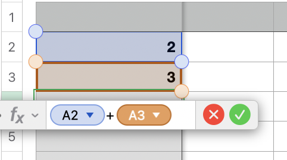
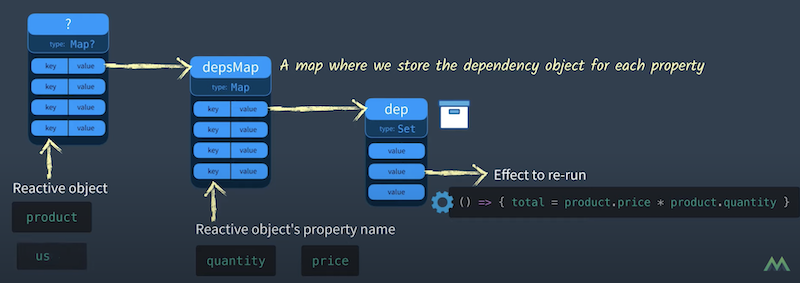

<!-- .slide: class="titulo" -->

# Tema 5: *Frameworks* JS en el cliente
## Parte III: Reactividad y _rendering_

---

<!-- .slide: class="titulo" -->

# Reactividad

---

Aunque **reactividad** es un término bastante amplio que tiene distintos significados en distintos contextos, en el contexto de los *frameworks* JS se suele entender como:

1. **cambiar automáticamente el valor de una variable** cuando esta depende de otra
2. **repintar la vista automáticamente cuando cambia el estado** del componente 

En general todos los *frameworks* JS son reactivos en el sentido (2), en el (1) solo algunos como Vue o Svelte

---

En su forma más básica, la reactividad no es nada nuevo

 <!-- .element class="stretch" -->


---

En *frameworks* JS se suelen distinguir dos tipos de reactividad:

- **Tipo *pull***: hay que llamar a un método para actualizar el estado, que a su vez "repinta" la vista. Por ejemplo: React, Svelte 2, Angular (aunque este último llama al método automáticamente por ejemplo en manejadores de evento)
- **Tipo *push***: al cambiar los datos se repinta la vista automáticamente. Ejemplos: Vue, Svelte 3, Knockout

---


## Ejemplos de reactividad tipo "pull"

- [Ejemplo de código "de juguete"](https://jsbin.com/cozigix/2/edit?html,js,console,output) 
  - Para probarlo escribir en la consola `setState({contador:0}`. A partir de ahí se puede usar el botón (que llama a `setState`) 
- [Ejemplo con el framework React](https://codepen.io/darylw/pen/vzKQNp?editors=0010) (podéis ver que la idea es la misma)


---

## Reactividad tipo "pull"

Implementación _naive_ y muy simplificada

```javascript
var update, state

//función a la que hay que pasar qué hacer cuando cambie el estado
var onStateChanged = function(update_fn)  {
  update = update_fn
}

//decimos: "cuando cambie el estado, queremos repintar la vista"
onStateChanged(function () {
  var view = render(state)
})

//función que sirve para cambiar el estado
var setState = function(newState) {
  state = newState
  update()
}
```

---

## Reactividad push

Como ya sabíais, Javascript no es reactivo:

```javascript
var a1 = 2
var a2 = 3
var total = a1 + a2
console.log(total)  //5
a1 = 10
console.log(total)  //sigue siendo 5 😕
```

sin embargo ya sabéis que Vue sí que lo es: [Ejemplo en JSBin](https://jsbin.com/nakomet/edit?html,js,output). Incluso podemos eliminar la parte de UI, y lo sigue siendo: [Ejemplo en JSBin](https://jsbin.com/nayojel/edit?html,js,output)


## Cómo funciona la reactividad en Vue 3


- Cada "operación reactiva" se encapsula en una función
- Vue lleva la pista de todas las dependencias

 <!-- .element class="stretch" -->

[Del video "Reactivity in Vue 3: How does it work?"](https://www.youtube.com/watch?v=NZfNS4sJ8CI) <!-- .element class="caption" -->


---

## Cómo funciona la reactividad en Vue 3 (II)


En las "operaciones reactivas"

- Se intercepta el *get* sobre las propiedades para guardar la operación asociada
- Se intercepta el *set* sobre una propiedad para recalcular las operaciones asociadas
)

```javascript
var datos = {a1:2, a2:3}

//Un proxy en ES6 "envuelve" a un objeto permitiendo añadirle funcionalidad
var datosProxy = new Proxy(datos, {
  get (target,key) {
    //aquí hago esto, pero en Vue estaría guardando la operación
    console.log('Estoy llamando al get')
    return target[key]
  }
})
```

---

## Otro ejemplo: Svelte 3


- Svelte es un framework similar a Vue, algo más ligero
- Internamente sigue un enfoque distinto, en lugar de hacer "la magia" en *runtime*, es un **compilador** que genera "código reactivo"

[Ejemplo online](https://svelte.dev/repl/a17ccc68af7d44948dee4b68256766dc?version=3.44.1)


---

<!-- .slide: class="titulo" -->

# *Rendering*

---


El *framework* debe permitirnos especificar cómo será la vista en función de los datos

```
vista = f(datos)
```

Aunque podríamos hacer muchas más diferencias hay *frameworks* que usan un lenguaje de **_templates_** (p.ej Angular, Svelte, Vue _en apariencia_) y otros usan directamente **Javascript** (p.ej React)

---

## Opción 1: lenguajes de templates

- Problema: nos vemos limitados a la expresividad del lenguaje
- Ventaja: Los *framework* suelen incluir un *compilador* de *templates* que puede optimizar la detección de cambios para el repintado

```html
<div id="content">
  <p class="text">Lorem impsum</p>
  <p class="text">Lorem impsum</p>
  <p class="text">{{mensaje}}</p>
  <p class="text">Lorem impsum</p>
  <p class="text">Lorem impsum</p>
</div>
```

En el ejemplo, solo puede cambiar el tercer `<p>`, así que **para repintar el componente *como mucho* solo hace falta repintar ese `<p>`**


---

## Opción 2: JS para definir *templates*

- En React podemos generar una etiqueta con la función `React.createElement(<tag>, <atributos>, <hijos>)`
- Podemos generar HTML arbitrario combinando en JS varias llamadas a `createElement` 

```javascript
//esto es como la "f" de vista=f(datos) 
function HelloReact(props) {
  return React.createElement("div", null, 
            React.createElement("h1", null, props.saludo), 
            React.createElement("p", null, "Welcome to React"));
}
//maquinaria necesaria para pintar el componente React en la página
const element = <HelloReact saludo="Ehh!!"/>;
ReactDOM.render(
  element,
  //suponiendo que exista un tag con id="mountNode"
  document.getElementById('mountNode')
);
```
[Probar ejemplo](https://jscomplete.com/playground/s357745)

---

Usar JS para la función de *render* tiene la **ventaja** de que **podemos usar toda la expresividad de JS** (control de flujo, funciones de la librería estándar, propias,...)

```javascript
//Aclaración: nadie programa así en React, normalmente se usa un formato llamado JSX,
//que permite poner las etiquetas en el JS y es mucho más legible
function Ejemplo(props) {
    const c = React.createElement
    const children = []
    for(var i=0; i<5; i++) {
        children.push(c('p', {class:'text'},
                       i == 2 ? props.mensaje.toUpperCase() : 'Lorem ipsum'))
    }
    return c('div', {id:'content'}, children)
}

const element = <Ejemplo mensaje="Hola amigos" />;
ReactDOM.render(
  element,
  document.getElementById('mountNode')
);
```

[Ejemplo online](https://jscomplete.com/playground/s357763) | [Ejemplo con sintaxis JSX](https://jscomplete.com/playground/s768783)

---

**Problema**: el lenguaje es tan expresivo que el *framework* no puede analizar qué estamos haciendo y no puede optimizar el proceso de repintado.

Como hemos visto en los ejemplos, el desarrollador lo programa como si se repintara todo el árbol (*como los gráficos de un juego que se repintan enteros n veces por segundo*) ([ejemplo del reloj](https://codepen.io/ottocol/pen/QWWVWPa?editors=1010))

¿Cómo reducir entonces el coste del repintado?

---

## DOM virtual

- Idea introducida por React
- La función `React.createElement` no genera nodos del DOM real, sino nodos en memoria (en un "árbol DOM virtual"), con un API más rápido
- En cada *render* se hace una especie de *diff* entre el DOM virtual actual y el anterior (denominada en React ["reconciliation"](https://reactjs.org/docs/reconciliation.html). Según la documentación de React el coste es lineal con el número de nodos
- **Solo se repintan en el DOM real los nodos que cambian**. 


---

[Ejemplo del reloj](https://codepen.io/ottocol/pen/QWWVWPa?editors=1010)

Para verlo hay que abrir la consola de desarrolladores del navegador, ir a ver el código fuente en "tiempo real" (pestaña "Elements" en Chrome, "Inspector" en Firefox) y buscar el div con id="root". Pese a que en el código de la función de render se repinta el componente entero, en el navegador solo se está cambiando un nodo.

---

## Vue y el Virtual DOM

- Curiosamente, aunque Vue usa plantillas para describir el HTML de los componentes, estas internamente se comportan como funciones JS, de hecho podemos escribir la función render() si las plantillas "se nos quedan pequeñas"
- Es por esto que Vue también usa un DOM virtual
- Por el contrario, frameworks como Svelte no lo necesitan

---


## Referencias

- 📺 [dotJS 2016 - Evan You - Reactivity in Frontend JavaScript Frameworks](https://www.youtube.com/watch?v=r4pNEdIt_l4)
- 📺 [Evan You on Vue.js: Seeking the Balance in Framework Design | JSConf.Asia 2019](https://www.youtube.com/watch?v=ANtSWq-zI0s)
- 📺 📄[Svelte 3: Rethinking reactivity](https://svelte.dev/blog/svelte-3-rethinking-reactivity)
- Reactivity in Vue 3: How does it work? [video1](https://www.youtube.com/watch?v=NZfNS4sJ8CI) [video2](https://www.vuemastery.com/courses/vue-3-reactivity/proxy-and-reflect/) (para ver el vídeo 2 tenéis que registraros en el sitio web del curso de Vue) 