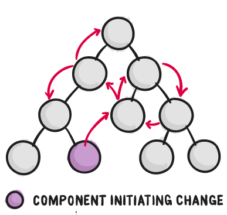

<!-- .slide: class="titulo" -->

# Tema 5: Frameworks JS en el cliente 
## parte II: Gestión del estado

---

> "Como los requisitos en aplicaciones JavaScript de una sola página se están volviendo cada vez más complicados, nuestro código, mas que nunca, debe manejar el estado. **Este estado puede incluir respuestas del servidor y datos cacheados, así como datos creados localmente que todavía no fueron guardados en el servidor. El estado de las UI también se volvió más complejo**, al necesitar mantener la ruta activa, el tab seleccionado, si mostrar o no un spinner...

> **Controlar ese cambiante estado es difícil**. Si un modelo puede actualizar otro modelo, entonces una vista puede actualizar un modelo, el cual actualiza otro modelo, y esto causa que otra vista se actualice. **En cierto punto, ya no se entiende que esta pasando en la aplicación ya que perdiste control sobre el cuándo, el por qué y el cómo de su estado**. 

De la documentación de Redux: ["Motivación"](http://es.redux.js.org/docs/introduccion/motivacion.html) 

---


<blockquote class="twitter-tweet"><p lang="en" dir="ltr">If you don&#39;t think managing state is tricky, consider the fact that 80% of all problems in all complex systems are fixed by rebooting.</p>&mdash; stuarthalloway (@stuarthalloway) <a href="https://twitter.com/stuarthalloway/status/1134806008528809985?ref_src=twsrc%5Etfw">June 1, 2019</a></blockquote> <script async src="https://platform.twitter.com/widgets.js" charset="utf-8"></script>

---

<!-- .slide: class="titulo" -->

## 1. Estado local vs estado centralizado

---

Recordemos que las aplicaciones Vue, React, Angular... están formadas de **componentes organizados jerárquicamente**


---

- Una idea *natural* es que **cada componente almacene localmente su estado**
- Problema: conforme crece el número de componentes las **comunicaciones** se hacen mucho más **complicadas**




---

Principios de diseño importantes:

>  Almacenar el **estado** en el componente de **nivel superior**

Beneficio: si un componente no tiene estado podemos considerar la vista como una **función pura de sus `props`**. ([ejemplo](https://jsbin.com/hidokec/5/edit?html,js,output))

Simplifica el *testing* y el razonamiento sobre el componente 

---

Principios de diseño importantes: 

> Mantener un **flujo unidireccional** de información

- Si cambia el estado: comunicación de "padres" a "hijos" con las *props*
- Si hay que cambiarlo : de "hijos" a "padres" mediante eventos

Beneficio: más fácil seguir la pista de los cambios si hay algún *bug*

---

Aún así, puede que tengamos casos en que necesitemos comunicar componentes no relacionados entre sí.

Para evitar acoplamiento entre componentes podemos usar un **event bus**

---

## Event Bus

- Es simplemente un objeto global que permite **publicar eventos y suscribirse a ellos**. Los eventos serán los mensajes entre componentes.


- En Javascript este patrón suele llamarse *event bus* o *event emitter*. Hay multitud de librerías que implementan esta idea

---

## Event Bus en Vue

Tenemos que usar alguna librería externa (aquí usamos [mitt]())

```javascript
//Esto debería ser global a todos los componentes
import mitt from "mitt"
const emitter = mitt()

//para emitir un evento:
emitter.emit("nombre-evento", {dato1:"hola", dato2:1})

//para suscribirse a un evento:
emitter.on("nombre-evento", function(payload) { console.log(payload.dato1)})
```


[Ejemplo completo](https://codesandbox.io/s/event-bus-mitt-vue3-zoyhk)

---

Por desgracia, el *event bus* rompe la idea de *flujo unidireccional*. 

**¿Cómo podemos seguir manteniendo un flujo unidireccional de información en toda la aplicación?**


---

<!-- .slide: class="titulo" -->

## 2. Estado centralizado. El patrón *Store*

---

Idea: ¿por qué no sacamos el estado fuera de todos los componentes y nos lo llevamos a un "almacén centralizado"?

<!-- .element: class="stretch" --> 


De ese modo **todos los componentes** se convertirían en funcionales

---

```javascript
const { createApp, reactive } = Vue

const sourceOfTruth = reactive({
  message: 'Hello'
})

const appA = createApp({
  data() {
    return sourceOfTruth
  }
}).mount('#app-a')

const appB = createApp({
  data() {
    return sourceOfTruth
  }
}).mount('#app-b')
```

[Ejemplo completo](https://jsbin.com/jadujut/1/edit?html,js,console,output)

Problema: `sourceOfTruth` está actuando como una **variable global** que podemos modificar desde cualquier componente Vue

---

## El "patrón" *store*

<div class="wrapper texto_figura">
<div>

- _store_: almacén centralizado con el estado de la _app_
- Los componentes **no modifican directamente** el estado, las modificaciones se hacen siempre a través de **métodos del *store*** 

```javascript
var store = {
  state: reactive({
    message: 'Hello!'
  }),
  setMessage (newValue) {
    this.state.message = newValue
  },
  clearMessage () {
    this.state.message = ''
  }
}
```
[Ejemplo completo](https://jsbin.com/hidokec/2/edit?html,js,console,output)
</div>

<div>
 
</div>
</div>

---

<!-- .slide: class="titulo" -->

## 3. Vuex


---

**Vuex** es el *framework* "oficial" de Vue para la gestión centralizada del estado. Es una implementación del "patrón *store*" (algo más sofisticada que lo que vimos antes)

Aunque es propio de Vue se basa en los mismos principios básicos que se aplican habitualmente en el resto de *frameworks* Javascript: React, Angular, ...


---

## Antecedentes de Vuex

- **[La arquitectura Elm](https://guide.elm-lang.org/architecture/)** (2012): Elm es un lenguaje específico para clientes web que transpila a JS
- **[Flux](https://facebook.github.io/flux/)** (2014): arquitectura propuesta por Facebook  para estructurar aplicaciones con su framework React
- **[Redux](https://es.redux.js.org/)** (2015): la variante de Flux de mayor éxito, normalmente usada en React pero portada luego a frameworks como Angular o Vue

---

## El patrón *store* básico en Vuex

- El *store* es un objeto que contiene las propiedades 
  + `state`: el "árbol global" con el estado de la *app*
  + `mutations`: métodos para modificar el estado (en redux se llaman `actions`)

```javascript
const store = new Vuex.Store({
  state: {
    count: 0
  },
  mutations: {
    increment (state) {
      state.count++
    }
  }
})
```
Los métodos en `mutations` no se llaman directamente, sino a través de `commit`

```javascript
//a commit se le pasa el nombre de la mutación
store.commit('increment')
```

---

## Componente que usa el *store*

- Tiene una propiedad calculada (_computed_) a partir del _state_ del _store_. Al ser éstas reactivas, **un cambio en el _store_ desencadena un repintado** del componente.
- Llamamos a `commit` sobre el *store* para cambiar el estado

```javascript
Vue.component('contador', {
  computed: {
    count () {
      return store.state.count
    }
  },
  //Aquí falta el template, mirar el ejemplo completo
  methods: {
    increment () {
      store.commit('increment')
    },
    decrement () {
      store.commit('decrement')
    }
  }
})
```

[Ejemplo completo en JSBin](https://jsbin.com/rahoyaj/edit?html,js,output)


---

## Flujo unidireccional en Vuex


<!-- .element: class="stretch" -->


Nota: todavía no hemos visto las *actions*, son como las mutaciones pero para 
operaciones asíncronas

---

## Vuex vs. Redux

 <!-- .element: class="column half" -->
 <!-- .element: class="column half" -->

Nota: para complicar un poco la comparación, lo que en Vuex se llaman *mutations* en *Redux* son *actions*, pero son lo mismo.


---

Para **aplicaciones pequeñas, Vuex/Redux/NgRedux... no son necesarios**

> **People often choose Redux before they need it**. “What if our app doesn’t scale without it?” **Later, developers frown at the indirection Redux introduced to their code**. “Why do I have to touch three files to get a simple feature working?” Why indeed!
People blame Redux, React, functional programming, immutability, and many other things for their woes, and I understand them. It is natural to compare Redux to an approach that doesn’t require “boilerplate” code to update the state, and to conclude that Redux is just complicated

<!-- .element: class="caption" --> 
  Dan Abramov, [You Might Not Need Redux](https://medium.com/@dan_abramov/you-might-not-need-redux-be46360cf367)"

---

Aunque en teoría el estado debe estar **todo** en el *store* eso no significa que en la práctica no podamos tener algo de estado en algún componente, sobre todo el estado referente a la interfaz de usuario

---

## Las mutaciones pueden tener parámetros

```javascript
// En el store
mutations: {
  increment (state, payload) {
    state.count += payload.amount
  }
}
```

```javascript
//En un componente que dispare mutaciones
store.commit('increment', {
  amount: 10
})
```

---

## ¿Qué pasa con los formularios?

`v-model` se usa típicamente para vincular un campo de formulario con un dato del estado. Problema: el estado del *store* no se puede cambiar directamente

```javascript
<input v-model="store.state.mensaje">. //¡Error!
```

Una solución es vincular el evento `input` o `change` del campo a un método del componente que haga `commit` de una mutación (salvando las distancias, así es como se hace en React)

---

## ¿Qué pasa con los formularios? (II)

Solución más corta: Usar una propiedad *computed* con *setter* (al cambiar la propiedad en realidad estamos llamando a un método -> `commit` de una mutación)

```html
<input v-model="mensaje">
```

```javascript
computed: {
  mensaje: {
    get () {
      return store.state.mensaje
    },
    set (valor) {
      store.commit('actualizarMensaje', valor)
    }
  }
}
```

---


## Time travel debugging


Como los cambios en el estado siempre se hacen con mutaciones, si hacemos un *log* de todas ellas, avanzando y retrocediendo por él podemos **reproducir el estado de la aplicación en cualquier momento**

<!-- .element: class="r-stretch" -->


---

## Acciones

Son **mutaciones asíncronas**

Reciben como 1er parámetro `context`, da acceso al estado del *store* (`context.store`) y a despachar mutaciones (`context.commit`)

Típicamente una acción despacha varias mutaciones, que marcan "puntos concretos" en su flujo temporal.

```javascript
//En el store
actions: {
  //Una supuesta acción para pedir la lista de la compra al servidor
  getItems (context) {
    //esto mostraría un spinner o similar
    context.commit('GETITEMS_START')
    try {
      var result = await ClienteAPI.getItems()
      //esta acción rellenaría el store con los items para que se muestren
      //en el componente que dependa de ellos
      context.commit('GETITEMS_OK')
    }
    catch { 
      context.commit('GETITEMS_ERROR'),
    }
  }
}
```

---

## Escalando el *store*

Para evitar que el *store* se convierta en un "monstruo global" se puede dividir en *módulos*, cada uno con sus propias acciones, mutaciones, etc, incluidos submódulos.

```javascript
const moduleA = {
  state: { ... },
  mutations: { ... },
  actions: { ... },
  getters: { ... }
}

const moduleB = {
  state: { ... },
  mutations: { ... },
  actions: { ... }
}

const store = new Vuex.Store({
  modules: {
    a: moduleA,
    b: moduleB
  }
})
```

---

Ejercicio: [lista de la compra](https://codesandbox.io/s/7kp0qy22w1) (en local, sin API remoto)

